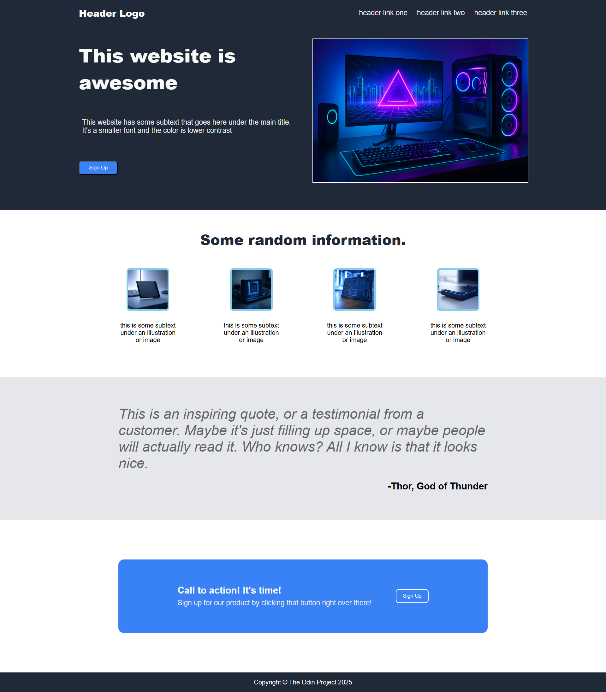

# Foundations_Landing_Page

This is a simple landing page built using **HTML** and **CSS**. It was created as part of a web development learning project to practice layout design, flexbox. It does not use a responsive design.

## 🔍 Features

- Modern layout using Flexbox
- Clean and simple UI
- Image styling with rounded borders
- Semantic HTML structure

## Screenshot

## Preview

- This is the live preview of my [Landing Page](https://rj23lolwa.github.io/Foundations_Landing_Page/)

## Acknowledgement

The Odin Project

## Image Credit

Images are generated using ChatGpt and GrokAI 
